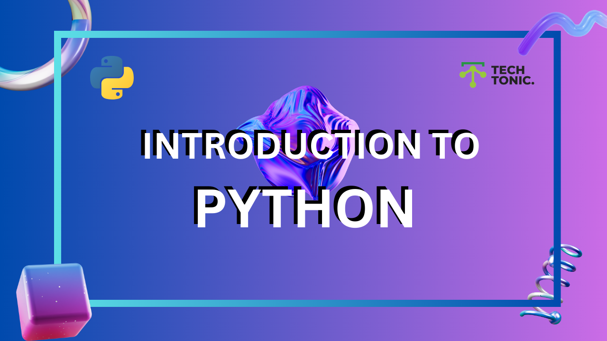

# Cataloge
### 01 [python-lists](#01-python-lists)
### 02 [python-set](#02-python-set)
### 03 [python-tuple](#03-python-tuple)
### 04 [python-dictionary](#04-python-dictionary)
### 05 [python-functions](#05-python-functions)


---

# 01 Python Lists  

## **Introduction**  
A Python list is an **ordered, mutable collection** that can hold items of various data types. Lists are versatile and widely used in Python for data manipulation.  

---

## **1. Creating a List**  
### Syntax  
Use square brackets `[]` to define a list. Items are separated by commas `,`.  

**Examples**  
```python
# Simple list of strings
pets = ["dog", "cat", "rabbit"]
print(pets)

# List with mixed data types
mixed_list = ["dog", 21, True]
print(mixed_list)
```

### Using the `list()` Constructor  
```python
# Creating a list using the constructor
pets = list(("dog", "cat", "rabbit"))
print(pets)  # Output: ['dog', 'cat', 'rabbit']
```

---

## **2. Accessing List Elements**  
### **Indexing**  
List indexing starts at **0**. Use indices to access specific elements.  

**Examples**  
```python
pets = ["dog", "cat", "rabbit"]
print(pets[0])  # Output: dog
print(pets[2])  # Output: rabbit
```

### **Negative Indexing**  
Negative indices start from `-1` for the last item.  
```python
pets = ["dog", "cat", "rabbit"]
print(pets[-1])  # Output: rabbit
print(pets[-2])  # Output: cat
```

### **Range of Indexes**  
Use a colon `:` to access a range of items.  
```python
pets = ["dog", "cat", "rabbit", "fish", "hamster"]

# From index 1 to 3 (excluding 3)
print(pets[1:3])  # Output: ['cat', 'rabbit']

# Shortcut examples
print(pets[:2])  # Output: ['dog', 'cat']  # Start from beginning
print(pets[2:])  # Output: ['rabbit', 'fish', 'hamster']  # Till the end
```

---

## **3. Modifying Lists**  
### **Adding Items**  
#### Using `append()`  
Adds an item to the **end** of the list.  
```python
pets = ["dog", "cat"]
pets.append("rabbit")
print(pets)  # Output: ['dog', 'cat', 'rabbit']
```

#### Using `insert()`  
Adds an item at a **specific index**.  
```python
pets = ["dog", "cat", "fish"]
pets.insert(1, "rabbit")  # Insert at index 1
print(pets)  # Output: ['dog', 'rabbit', 'cat', 'fish']
```

### **Deleting Items**  
#### Using `pop()`  
Removes the last item (default) or an item at a specified index.  
```python
pets = ["dog", "cat", "rabbit"]
pets.pop()  # Remove last item
print(pets)  # Output: ['dog', 'cat']
```

#### Using `remove()`  
Deletes an item by value.  
```python
pets = ["dog", "cat", "rabbit"]
pets.remove("cat")
print(pets)  # Output: ['dog', 'rabbit']
```

#### Using `del` Keyword  
Deletes an item by index or clears the list.  
```python
pets = ["dog", "cat", "rabbit"]
del pets[1]  # Delete 'cat'
print(pets)  # Output: ['dog', 'rabbit']
```

---

## **4. Other Operations**  

### **Get the Length**  
```python
pets = ["dog", "cat", "rabbit"]
print(len(pets))  # Output: 3
```

### **Modify Item**  
```python
pets = ["dog", "cat", "rabbit"]
pets[2] = "fish"
print(pets)  # Output: ['dog', 'cat', 'fish']
```

### **Check for an Item**  
```python
pets = ["dog", "cat", "rabbit"]
print("dog" in pets)  # Output: True
```

### **Extend a List**  
```python
nums1 = [1, 2, 3]
nums2 = [4, 5, 6]
nums1.extend(nums2)
print(nums1)  # Output: [1, 2, 3, 4, 5, 6]
```

---

## **5. Looping Through a List**  
```python
pets = ["dog", "cat", "rabbit"]
for pet in pets:
    print(pet)
```

---

## **6. List Comprehension**  
An elegant way to create or modify lists.  
```python
# Create a list of squares
squares = [x**2 for x in range(5)]
print(squares)  # Output: [0, 1, 4, 9, 16]
```

---

## **Exercises**  

### **Easy**  
1. Create a list of five fruit names and print it.  
2. Access and print the last element in the list `["apple", "banana", "cherry"]`.  
3. Add `"kiwi"` to the list `["apple", "banana"]` and print the updated list.  
4. Remove `"banana"` from the list `["apple", "banana", "cherry"]`.  
5. Use a loop to print each item in the list `["cat", "dog", "fish"]`.  

### **Medium**  
1. Create a list of numbers from 1 to 10 and print only the even numbers.  
2. Reverse the list `["red", "green", "blue"]`.  
3. Combine the two lists `[1, 2, 3]` and `[4, 5, 6]` into one list.  
4. Modify the list `[5, 10, 15]` by replacing `10` with `12`.  
5. Find the length of the list `["a", "b", "c", "d"]` and print it.  

### **Hard**  
1. Use list comprehension to generate a list of squares for numbers from 1 to 10, excluding numbers divisible by 3.  
2. Create a nested list (matrix) and print the second row.  
3. Write a program to find duplicates in a list `[1, 2, 3, 2, 4, 5, 1]`.  
4. Sort the list `[3, 1, 4, 1, 5, 9]` in descending order without using the `sort()` method.  
5. Flatten a nested list `[[1, 2], [3, 4], [5, 6]]` into a single list `[1, 2, 3, 4, 5, 6]`.  

---

---


# 02 Python Set

## **Introduction to Sets**
A **set** in Python is an **unordered collection of unique items**. Sets are commonly used for storing unique elements, performing set operations, and removing duplicates.

### **Key Characteristics**
- **Unordered**: Items do not have a fixed position or order.
- **Mutable**: You can add or remove items, but the individual items must be immutable (e.g., strings, numbers, tuples).
- **Unique**: Duplicate items are automatically removed.
  
---

## **Creating a Set**
You can create a set using curly brackets `{}` or the `set()` constructor.

### **Examples**
```python
# Using curly brackets
fruits = {"apple", "banana", "cherry"}
print(fruits)  # Output: {'apple', 'banana', 'cherry'}

# Using the set() constructor
colors = set(["red", "blue", "green"])
print(colors)  # Output: {'red', 'blue', 'green'}
```

### **Note**
Sets cannot contain mutable types like lists, dictionaries, or other sets. They can, however, include immutable types like strings, numbers, and tuples.

---

## **Accessing Items**
Since sets are unordered, they do not support indexing or slicing. However, you can loop through a set.

### **Example**
```python
pets = {"dog", "cat", "rabbit"}
for pet in pets:
    print(pet)
# Output (order may vary):
# dog
# cat
# rabbit
```

---

## **Adding Items to a Set**
You can add elements to a set using:
1. **`add()`**: Adds a single item.
2. **`update()`**: Adds multiple items or merges another iterable.

### **Examples**
```python
# Adding a single item
pets = {"dog", "cat"}
pets.add("rabbit")
print(pets)  # Output: {'dog', 'cat', 'rabbit'}

# Adding multiple items
pets.update(["parrot", "fish"])
print(pets)  # Output: {'dog', 'cat', 'rabbit', 'parrot', 'fish'}
```

---

## **Removing Items**
Sets allow the removal of elements using:
1. **`remove()`**: Removes an item; raises an error if the item is not found.
2. **`discard()`**: Removes an item; does not raise an error if the item is not found.
3. **`pop()`**: Removes and returns a random item.
4. **`clear()`**: Removes all items from the set.

### **Examples**
```python
pets = {"dog", "cat", "rabbit"}

# Using remove()
pets.remove("cat")
print(pets)  # Output: {'dog', 'rabbit'}

# Using discard()
pets.discard("rabbit")
print(pets)  # Output: {'dog'}

# Using pop()
pets.pop()  # Removes a random item
print(pets)  # Output: {}

# Clearing the set
pets = {"dog", "cat"}
pets.clear()
print(pets)  # Output: set()
```

---

## **Set Operations**
Sets support various operations for combining, comparing, and modifying sets.

### **Union**
Combines two sets, removing duplicates. Use the `union()` method or the `|` operator.
```python
x = {1, 2, 3}
y = {3, 4, 5}
print(x.union(y))  # Output: {1, 2, 3, 4, 5}
```

### **Intersection**
Finds common items between two sets. Use the `intersection()` method or the `&` operator.
```python
print(x.intersection(y))  # Output: {3}
```

### **Difference**
Finds items in one set but not in the other. Use the `difference()` method or the `-` operator.
```python
print(x.difference(y))  # Output: {1, 2}
```

### **Symmetric Difference**
Finds items that are in either set but not in both. Use the `symmetric_difference()` method or the `^` operator.
```python
print(x.symmetric_difference(y))  # Output: {1, 2, 4, 5}
```

---

## **Other Useful Methods**
- **`issubset()`**: Checks if one set is a subset of another.
- **`issuperset()`**: Checks if one set contains another.
- **`isdisjoint()`**: Checks if two sets have no items in common.

---

## **Checking for Membership**
Use the `in` and `not in` operators to check if an item exists in a set.
```python
fruits = {"apple", "banana", "cherry"}
print("apple" in fruits)  # Output: True
print("kiwi" not in fruits)  # Output: True
```

---

## **Set Length**
Use the `len()` function to get the number of items in a set.
```python
fruits = {"apple", "banana", "cherry"}
print(len(fruits))  # Output: 3
```

---

## **Exercises**

### **Easy Exercises**
1. Create a set of five vegetables and print it.
2. Add `"mango"` to the set `{"apple", "banana", "cherry"}`.
3. Use a loop to print each item in the set `{"python", "java", "c++"}`.
4. Remove `"dog"` from the set `{"dog", "cat", "rabbit"}`.
5. Check if `"cat"` is in the set `{"dog", "cat", "rabbit"}`.

---

### **Medium Exercises**
1. Combine the sets `{1, 2, 3}` and `{3, 4, 5}` using `union()`.
2. Find the intersection of `{1, 2, 3, 4}` and `{3, 4, 5, 6}`.
3. Use the `difference()` method to find items in `{1, 2, 3, 4}` but not in `{3, 4, 5, 6}`.
4. Create a set of numbers from 1 to 5 and remove all items using `clear()`.
5. Write a program to find duplicates in a list using a set.

---

### **Hard Exercises**
1. Use a set to remove duplicate characters from a string.
   - Input: `"hello"`
   - Output: `{'h', 'e', 'l', 'o'}`
2. Create two sets of student names and find the symmetric difference.
3. Check if the set `{1, 2}` is a subset of `{1, 2, 3}`.
4. Write a function that takes two sets and returns a new set with all unique elements from both sets.
5. Create a program that counts the unique words in a sentence using a set.

---

# 03 Python Tuple

Tuples in Python are ordered, immutable containers that can hold a collection of items. Tuples are similar to lists but differ in their immutability, meaning their items cannot be modified after creation. This feature makes tuples an excellent choice for storing fixed data that shouldn't change.

---

### **Key Characteristics of Tuples**
1. **Ordered**: The items in a tuple have a defined order.
2. **Immutable**: Once created, you cannot change, add, or remove items.
3. **Supports Mixed Data Types**: Tuples can hold elements of different data types (e.g., strings, integers, booleans).

---

### **Creating a Tuple**
Tuples are created using **round brackets** `()`. Items are separated by commas.

#### Example:
```python
pets = ("dog", "cat", "rabbit")
print(pets)  # Output: ('dog', 'cat', 'rabbit')
```

#### Mixed Data Types:
```python
mixed = ("dog", 21, True)
print(mixed)  # Output: ('dog', 21, True)
```

#### Using the `tuple()` Constructor:
```python
pets = tuple(("dog", "cat", "rabbit"))  # Note the double parentheses
print(pets)  # Output: ('dog', 'cat', 'rabbit')
```

---

### **Accessing Tuple Items**
Tuples support various ways to access their elements using **indexing**, **negative indexing**, and **slicing**.

#### Indexing:
```python
pets = ("dog", "cat", "rabbit")
print(pets[0])  # Output: 'dog'
print(pets[2])  # Output: 'rabbit'
```

#### Negative Indexing:
```python
print(pets[-1])  # Output: 'rabbit' (last item)
print(pets[-2])  # Output: 'cat'
```

#### Slicing:
- Use a colon `:` to specify a range.
- The start index is inclusive, while the end index is exclusive.

```python
pets = ("dog", "cat", "rabbit", "fish", "hamster")
print(pets[1:4])  # Output: ('cat', 'rabbit', 'fish')
```

#### Omitting Start or End Index:
```python
print(pets[:3])  # Output: ('dog', 'cat', 'rabbit')
print(pets[2:])  # Output: ('rabbit', 'fish', 'hamster')
```

---

### **Tuple Operations**

#### Getting the Length:
Use the `len()` function to determine the number of items in a tuple.
```python
print(len(pets))  # Output: 5
```

#### Looping Through a Tuple:
```python
for pet in pets:
    print(pet)
# Output:
# dog
# cat
# rabbit
# fish
# hamster
```

#### Checking Membership:
Use the `in` operator to check if an item exists in the tuple.
```python
print("cat" in pets)  # Output: True
print("lion" in pets)  # Output: False
```

#### Combining Tuples:
You can combine two tuples using the `+` operator.
```python
pets1 = ("dog", "cat")
pets2 = ("rabbit", "fish")
all_pets = pets1 + pets2
print(all_pets)  # Output: ('dog', 'cat', 'rabbit', 'fish')
```

---

### **Immutability of Tuples**
Since tuples are immutable:
1. **Items cannot be changed**:
    ```python
    my_tuple = (1, 2, 3)
    my_tuple[0] = 10  # Raises an error
    ```
2. **Items cannot be added or removed**:
    ```python
    my_tuple.append(4)  # Raises an error
    my_tuple.remove(2)  # Raises an error
    ```

---

### **Tuple Exercises**

#### **Easy Exercises**
1. Create a tuple of five colors and print it.
2. Access the second and last item of a tuple.
3. Slice the tuple `("red", "blue", "green", "yellow", "purple")` to get the middle three items.
4. Check if `"orange"` exists in the tuple `("red", "blue", "green")`.
5. Use a loop to print all items in the tuple `("apple", "banana", "cherry")`.

#### **Medium Exercises**
1. Create two tuples and merge them into one.
2. Write a program to count how many times a specific item appears in a tuple.
3. Extract only the numeric items from a tuple `("apple", 42, 3.14, "banana", 7)`.
4. Find the length of the tuple `("a", "b", "c", "d", "e")` without using `len()`.
5. Use negative indexing to reverse a tuple.

#### **Hard Exercises**
1. Write a function to check if two tuples have at least one common item.
2. Convert a tuple of strings to uppercase: `("hello", "world") → ("HELLO", "WORLD")`.
3. Write a program to find the unique elements in two tuples.
4. Implement a function that takes a tuple and returns a new tuple with only even numbers.
5. Create a tuple of mixed data types and filter out only the string elements.

---

# 04 Dictionaries

A dictionary is a collection of unordered, modifiable(mutable) paired (key: value) data type.

### Creating a Dictionary

To create a dictionary we use curly brackets, {} or the *dict()* built-in function.

```py
# syntax
empty_dict = {}
# Dictionary with data values
dct = {'key1':'value1', 'key2':'value2', 'key3':'value3', 'key4':'value4'}
```

**Example:**

```py
person = {
    'first_name':'Asabeneh',
    'last_name':'Yetayeh',
    'age':250,
    'country':'Finland',
    'is_marred':True,
    'skills':['JavaScript', 'React', 'Node', 'MongoDB', 'Python'],
    'address':{
        'street':'Space street',
        'zipcode':'02210'
    }
    }
```

The dictionary above shows that a value could be any data types:string, boolean, list, tuple, set or a dictionary.

### Dictionary Length

It checks the number of 'key: value' pairs in the dictionary.

```py
# syntax
dct = {'key1':'value1', 'key2':'value2', 'key3':'value3', 'key4':'value4'}
print(len(dct)) # 4
```

**Example:**

```py
person = {
    'first_name':'Asabeneh',
    'last_name':'Yetayeh',
    'age':250,
    'country':'Finland',
    'is_married':True,
    'skills':['JavaScript', 'React', 'Node', 'MongoDB', 'Python'],
    'address':{
        'street':'Space street',
        'zipcode':'02210'
    }
    }
print(len(person)) # 7

```

### Accessing Dictionary Items

We can access Dictionary items by referring to its key name.

```py
# syntax
dct = {'key1':'value1', 'key2':'value2', 'key3':'value3', 'key4':'value4'}
print(dct['key1']) # value1
print(dct['key4']) # value4
```

**Example:**

```py
person = {
    'first_name':'Asabeneh',
    'last_name':'Yetayeh',
    'age':250,
    'country':'Finland',
    'is_marred':True,
    'skills':['JavaScript', 'React', 'Node', 'MongoDB', 'Python'],
    'address':{
        'street':'Space street',
        'zipcode':'02210'
    }
    }
print(person['first_name']) # Asabeneh
print(person['country'])    # Finland
print(person['skills'])     # ['JavaScript', 'React', 'Node', 'MongoDB', 'Python']
print(person['skills'][0])  # JavaScript
print(person['address']['street']) # Space street
print(person['city'])       # Error
```

Accessing an item by key name raises an error if the key does not exist. To avoid this error first we have to check if a key exist or we can use the _get_ method. The get method returns None, which is a NoneType object data type, if the key does not exist.
```py
person = {
    'first_name':'Asabeneh',
    'last_name':'Yetayeh',
    'age':250,
    'country':'Finland',
    'is_marred':True,
    'skills':['JavaScript', 'React', 'Node', 'MongoDB', 'Python'],
    'address':{
        'street':'Space street',
        'zipcode':'02210'
    }
    }
print(person.get('first_name')) # Asabeneh
print(person.get('country'))    # Finland
print(person.get('skills')) #['HTML','CSS','JavaScript', 'React', 'Node', 'MongoDB', 'Python']
print(person.get('city'))   # None
```

### Adding Items to a Dictionary

We can add new key and value pairs to a dictionary

```py
# syntax
dct = {'key1':'value1', 'key2':'value2', 'key3':'value3', 'key4':'value4'}
dct['key5'] = 'value5'
```

**Example:**

```py
person = {
    'first_name':'Asabeneh',
    'last_name':'Yetayeh',
    'age':250,
    'country':'Finland',
    'is_marred':True,
    'skills':['JavaScript', 'React', 'Node', 'MongoDB', 'Python'],
    'address':{
        'street':'Space street',
        'zipcode':'02210'
        }
}
person['job_title'] = 'Instructor'
person['skills'].append('HTML')
print(person)
```

### Modifying Items in a Dictionary

We can modify items in a dictionary

```py
# syntax
dct = {'key1':'value1', 'key2':'value2', 'key3':'value3', 'key4':'value4'}
dct['key1'] = 'value-one'
```

**Example:**

```py
person = {
    'first_name':'Asabeneh',
    'last_name':'Yetayeh',
    'age':250,
    'country':'Finland',
    'is_marred':True,
    'skills':['JavaScript', 'React', 'Node', 'MongoDB', 'Python'],
    'address':{
        'street':'Space street',
        'zipcode':'02210'
    }
    }
person['first_name'] = 'Eyob'
person['age'] = 252
```

### Checking Keys in a Dictionary

We use the _in_ operator to check if a key exist in a dictionary

```py
# syntax
dct = {'key1':'value1', 'key2':'value2', 'key3':'value3', 'key4':'value4'}
print('key2' in dct) # True
print('key5' in dct) # False
```

### Removing Key and Value Pairs from a Dictionary

- _pop(key)_: removes the item with the specified key name:
- _popitem()_: removes the last item
- _del_: removes an item with specified key name

```py
# syntax
dct = {'key1':'value1', 'key2':'value2', 'key3':'value3', 'key4':'value4'}
dct.pop('key1') # removes key1 item
dct = {'key1':'value1', 'key2':'value2', 'key3':'value3', 'key4':'value4'}
dct.popitem() # removes the last item
del dct['key2'] # removes key2 item
```

**Example:**

```py
person = {
    'first_name':'Asabeneh',
    'last_name':'Yetayeh',
    'age':250,
    'country':'Finland',
    'is_marred':True,
    'skills':['JavaScript', 'React', 'Node', 'MongoDB', 'Python'],
    'address':{
        'street':'Space street',
        'zipcode':'02210'
    }
    }
person.pop('first_name')        # Removes the firstname item
person.popitem()                # Removes the address item
del person['is_married']        # Removes the is_married item
```

### Changing Dictionary to a List of Items

The _items()_ method changes dictionary to a list of tuples.

```py
# syntax
dct = {'key1':'value1', 'key2':'value2', 'key3':'value3', 'key4':'value4'}
print(dct.items()) # dict_items([('key1', 'value1'), ('key2', 'value2'), ('key3', 'value3'), ('key4', 'value4')])
```

### Clearing a Dictionary

If we don't want the items in a dictionary we can clear them using _clear()_ method

```py
# syntax
dct = {'key1':'value1', 'key2':'value2', 'key3':'value3', 'key4':'value4'}
print(dct.clear()) # None
```

### Deleting a Dictionary

If we do not use the dictionary we can delete it completely

```py
# syntax
dct = {'key1':'value1', 'key2':'value2', 'key3':'value3', 'key4':'value4'}
del dct
```

### Copy a Dictionary

We can copy a dictionary using a _copy()_ method. Using copy we can avoid mutation of the original dictionary.

```py
# syntax
dct = {'key1':'value1', 'key2':'value2', 'key3':'value3', 'key4':'value4'}
dct_copy = dct.copy() # {'key1':'value1', 'key2':'value2', 'key3':'value3', 'key4':'value4'}
```

### Getting Dictionary Keys as a List

The _keys()_ method gives us all the keys of a a dictionary as a list.

```py
# syntax
dct = {'key1':'value1', 'key2':'value2', 'key3':'value3', 'key4':'value4'}
keys = dct.keys()
print(keys)     # dict_keys(['key1', 'key2', 'key3', 'key4'])
```

### Getting Dictionary Values as a List

The _values_ method gives us all the values of a a dictionary as a list.

```py
# syntax
dct = {'key1':'value1', 'key2':'value2', 'key3':'value3', 'key4':'value4'}
values = dct.values()
print(values)     # dict_values(['value1', 'value2', 'value3', 'value4'])
```

🌕 You are astonishing. Now, you are super charged with the power of dictionaries. You have just completed day 8 challenges and you are 8 steps a head in to your way to greatness. Now do some exercises for your brain and  muscles.

## 💻 Exercises: Day 8

1. Create  an empty dictionary called dog
2. Add name, color, breed, legs, age to the dog dictionary
3. Create a student dictionary and add first_name, last_name, gender, age, marital status, skills, country, city and address as keys for the dictionary
4. Get the length of the student dictionary
5. Get the value of skills and check the data type, it should be a list
6. Modify the skills values by adding one or two skills
7. Get the dictionary keys as a list
8. Get the dictionary values as a list
9. Change the dictionary to a list of tuples using _items()_ method
10. Delete one of the items in the dictionary
11. Delete one of the dictionaries

---

# 05 Functions

So far we have seen many built-in Python functions. In this section, we will focus on custom functions. What is a function? Before we start making functions, let us learn what a function is and why we need them?

### Defining a Function

A function is a reusable block of code or programming statements designed to perform a certain task. To define or declare a function, Python provides the _def_ keyword. The following is the syntax for defining a function. The function block of code is executed only if the function is called or invoked.

### Declaring and Calling a Function

When we make a function, we call it declaring a function. When we start using the it,  we call it _calling_ or _invoking_ a function. Function can be declared with or without parameters.

```py
# syntax
# Declaring a function
def function_name():
    codes
    codes
# Calling a function
function_name()
```

### Function without Parameters

Function can be declared without parameters.

**Example:**

```py
def generate_full_name ():
    first_name = 'Asabeneh'
    last_name = 'Yetayeh'
    space = ' '
    full_name = first_name + space + last_name
    print(full_name)
generate_full_name () # calling a function

def add_two_numbers ():
    num_one = 2
    num_two = 3
    total = num_one + num_two
    print(total)
add_two_numbers()
```

### Function Returning a Value - Part 1

Function can also return values, if a function does not have a return statement, the value of the function is None. Let us rewrite the above functions using return. From now on, we get a value from a function when we call the function and print it.

```py
def generate_full_name ():
    first_name = 'Asabeneh'
    last_name = 'Yetayeh'
    space = ' '
    full_name = first_name + space + last_name
    return full_name
print(generate_full_name())

def add_two_numbers ():
    num_one = 2
    num_two = 3
    total = num_one + num_two
    return total
print(add_two_numbers())
```

### Function with Parameters

In a function we can pass different data types(number, string, boolean, list, tuple, dictionary or set) as a parameter

- Single Parameter: If our function takes a parameter we should call our function with an argument

```py
  # syntax
  # Declaring a function
  def function_name(parameter):
    codes
    codes
  # Calling function
  print(function_name(argument))
```

**Example:**

```py
def greetings (name):
    message = name + ', welcome to Python for Everyone!'
    return message

print(greetings('Asabeneh'))

def add_ten(num):
    ten = 10
    return num + ten
print(add_ten(90))

def square_number(x):
    return x * x
print(square_number(2))

def area_of_circle (r):
    PI = 3.14
    area = PI * r ** 2
    return area
print(area_of_circle(10))

def sum_of_numbers(n):
    total = 0
    for i in range(n+1):
        total+=i
    print(total)
print(sum_of_numbers(10)) # 55
print(sum_of_numbers(100)) # 5050
```

- Two Parameter: A function may or may not have a parameter or parameters. A function may also have two or more parameters. If our function takes parameters we should call it with arguments. Let us check a function with two parameters:

```py
  # syntax
  # Declaring a function
  def function_name(para1, para2):
    codes
    codes
  # Calling function
  print(function_name(arg1, arg2))
```

**Example:**

```py
def generate_full_name (first_name, last_name):
    space = ' '
      full_name = first_name + space + last_name
      return full_name
print('Full Name: ', generate_full_name('Asabeneh','Yetayeh'))

def sum_two_numbers (num_one, num_two):
    sum = num_one + num_two
    return sum
print('Sum of two numbers: ', sum_two_numbers(1, 9))

def calculate_age (current_year, birth_year):
    age = current_year - birth_year
    return age;

print('Age: ', calculate_age(2021, 1819))

def weight_of_object (mass, gravity):
    weight = str(mass * gravity)+ ' N' # the value has to be changed to a string first
    return weight
print('Weight of an object in Newtons: ', weight_of_object(100, 9.81))
```

### Passing Arguments with Key and Value

If we pass the arguments with key and value, the order of the arguments does not matter.

```py
# syntax
# Declaring a function
def function_name(para1, para2):
    codes
    codes
# Calling function
print(function_name(para1 = 'John', para2 = 'Doe')) # the order of arguments does not matter here
```

**Example:**

```py
def print_fullname(firstname, lastname):
    space = ' '
    full_name = firstname  + space + lastname
    print(full_name)
print(print_fullname(firstname = 'Asabeneh', lastname = 'Yetayeh'))

def add_two_numbers (num1, num2):
    total = num1 + num2
    print(total)
print(add_two_numbers(num2 = 3, num1 = 2)) # Order does not matter
```

### Function Returning a Value - Part 2

If we do not return a value with a function, then our function is returning _None_ by default. To return a value with a function we use the keyword _return_ followed by the variable we are returning. We can return any kind of data types from a function.

- Returning a string:
**Example:**

```py
def print_name(firstname):
    return firstname
print_name('Asabeneh') # Asabeneh

def print_full_name(firstname, lastname):
    space = ' '
    full_name = firstname  + space + lastname
    return full_name
print_full_name(firstname='Asabeneh', lastname='Yetayeh')
```

- Returning a number:

**Example:**

```py
def add_two_numbers (num1, num2):
    total = num1 + num2
    return total
print(add_two_numbers(2, 3))

def calculate_age (current_year, birth_year):
    age = current_year - birth_year
    return age;
print('Age: ', calculate_age(2019, 1819))
```

- Returning a boolean:
  **Example:**

```py
def is_even (n):
    if n % 2 == 0:
        print('even')
        return True    # return stops further execution of the function, similar to break 
    return False
print(is_even(10)) # True
print(is_even(7)) # False
```

- Returning a list:
  **Example:**

```py
def find_even_numbers(n):
    evens = []
    for i in range(n + 1):
        if i % 2 == 0:
            evens.append(i)
    return evens
print(find_even_numbers(10))
```

### Function with Default Parameters

Sometimes we pass default values to parameters, when we invoke the function. If we do not pass arguments when calling the function, their default values will be used.

```py
# syntax
# Declaring a function
def function_name(param = value):
    codes
    codes
# Calling function
function_name()
function_name(arg)
```

**Example:**

```py
def greetings (name = 'Peter'):
    message = name + ', welcome to Python for Everyone!'
    return message
print(greetings())
print(greetings('Asabeneh'))

def generate_full_name (first_name = 'Asabeneh', last_name = 'Yetayeh'):
    space = ' '
    full_name = first_name + space + last_name
    return full_name

print(generate_full_name())
print(generate_full_name('David','Smith'))

def calculate_age (birth_year,current_year = 2021):
    age = current_year - birth_year
    return age;
print('Age: ', calculate_age(1821))

def weight_of_object (mass, gravity = 9.81):
    weight = str(mass * gravity)+ ' N' # the value has to be changed to string first
    return weight
print('Weight of an object in Newtons: ', weight_of_object(100)) # 9.81 - average gravity on Earth's surface
print('Weight of an object in Newtons: ', weight_of_object(100, 1.62)) # gravity on the surface of the Moon
```

### Arbitrary Number of Arguments

If we do not know the number of arguments we pass to our function, we can create a function which can take arbitrary number of arguments by adding \* before the parameter name.

```py
# syntax
# Declaring a function
def function_name(*args):
    codes
    codes
# Calling function
function_name(param1, param2, param3,..)
```

**Example:**

```py
def sum_all_nums(*nums):
    total = 0
    for num in nums:
        total += num     # same as total = total + num 
    return total
print(sum_all_nums(2, 3, 5)) # 10
```

### Default and Arbitrary Number of Parameters in Functions

```py
def generate_groups (team,*args):
    print(team)
    for i in args:
        print(i)
print(generate_groups('Team-1','Asabeneh','Brook','David','Eyob'))
```

### Function as a Parameter of Another Function

```py
#You can pass functions around as parameters
def square_number (n):
    return n * n
def do_something(f, x):
    return f(x)
print(do_something(square_number, 3)) # 27
```

🌕 You achieved quite a lot so far.  Keep going! You have just completed day 11 challenges and you are 11 steps a head in to your way to greatness. Now do some exercises for your brain and muscles.


## 💻 Exercises: Day 11

### Exercises: Level 1

1. Declare a function _add_two_numbers_. It takes two parameters and it returns a sum.
2. Area of a circle is calculated as follows: area = π x r x r. Write a function that calculates _area_of_circle_.
3. Write a function called add_all_nums which takes arbitrary number of arguments and sums all the arguments. Check if all the list items are number types. If not do give a reasonable feedback.
4. Temperature in °C can be converted to °F using this formula: °F = (°C x 9/5) + 32. Write a function which converts °C to °F, _convert_celsius_to-fahrenheit_.
5. Write a function called check-season, it takes a month parameter and returns the season: Autumn, Winter, Spring or Summer.
6. Write a function called calculate_slope which return the slope of a linear equation
7. Quadratic equation is calculated as follows: ax² + bx + c = 0. Write a function which calculates solution set of a quadratic equation, _solve_quadratic_eqn_.
8. Declare a function named print_list. It takes a list as a parameter and it prints out each element of the list.
9. Declare a function named reverse_list. It takes an array as a parameter and it returns the reverse of the array (use loops).

```py
print(reverse_list([1, 2, 3, 4, 5]))
# [5, 4, 3, 2, 1]
print(reverse_list1(["A", "B", "C"]))
# ["C", "B", "A"]
```

10. Declare a function named capitalize_list_items. It takes a list as a parameter and it returns a capitalized list of items
11. Declare a function named add_item. It takes a list and an item parameters. It returns a list with the item added at the end.

```py
food_staff = ['Potato', 'Tomato', 'Mango', 'Milk']
print(add_item(food_staff, 'Meat'))     # ['Potato', 'Tomato', 'Mango', 'Milk','Meat']
numbers = [2, 3, 7, 9]
print(add_item(numbers, 5))      [2, 3, 7, 9, 5]
```

12. Declare a function named remove_item. It takes a list and an item parameters. It returns a list with the item removed from it.

```py
food_staff = ['Potato', 'Tomato', 'Mango', 'Milk']
print(remove_item(food_staff, 'Mango'))  # ['Potato', 'Tomato', 'Milk'];
numbers = [2, 3, 7, 9]
print(remove_item(numbers, 3))  # [2, 7, 9]
```

13. Declare a function named sum_of_numbers. It takes a number parameter and it adds all the numbers in that range.

```py
print(sum_of_numbers(5))  # 15
print(sum_of_numbers(10)) # 55
print(sum_of_numbers(100)) # 5050
```

14. Declare a function named sum_of_odds. It takes a number parameter and it adds all the odd numbers in that range.
15. Declare a function named sum_of_even. It takes a number parameter and it adds all the even numbers in that - range.

### Exercises: Level 2

1. Declare a function named evens_and_odds . It takes a positive integer as parameter and it counts number of evens and odds in the number.

```py
    print(evens_and_odds(100))
    # The number of odds are 50.
    # The number of evens are 51.
```

1. Call your function factorial, it takes a whole number as a parameter and it return a factorial of the number
1. Call your function _is_empty_, it takes a parameter and it checks if it is empty or not
1. Write different functions which take lists. They should calculate_mean, calculate_median, calculate_mode, calculate_range, calculate_variance, calculate_std (standard deviation).

### Exercises: Level 3

1. Write a function called is_prime, which checks if a number is prime.
1. Write a functions which checks if all items are unique in the list.
1. Write a function which checks if all the items of the list are of the same data type.
1. Write a function which check if provided variable is a valid python variable
1. Go to the data folder and access the countries-data.py file.

- Create a function called the most_spoken_languages in the world. It should return 10 or 20 most spoken languages in the world in descending order
- Create a function called the most_populated_countries. It should return 10 or 20 most populated countries in descending order.
---

🎉 CONGRATULATIONS ! 🎉

[week 3 >>](./../Week-3/OOP.md)
